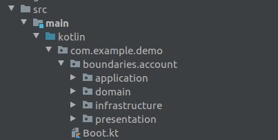

# Demo DDD Account Kotlin

> Exemplo de um projeto de ***estudo*** REST API utilizando DDD com Kotlin e Spring,   
> Fique a vontade para opinar e enviar Pull Request,   
> Assim podemos juntos evoluir o example e deixar disponivel para a cominidade.

**Stack:**   

- Kotlin 
- Spring Web
- Spring Actuator
- Spring Data
- Java 8

### Domain: Bank Account
--------------------

**Use Cases:**   

- Create New Account
- Create New Movement of Credit (Depósito)
- Create New Movement of Debit (Saque)
- Retrieve Account by Number (Extrato)

### Project Structure
---------------------

**Folders:**   

**Files:**   

### Architecture
---------------- 

**DDD Access layers:**    

**Hexagonal Architecture / Port Adapter:**   

 

### Open Source Project 
-----------------------

O objetivo deste projeto é aplicar o estudo do DDD usando a linguagem de programação **Kotlin** e o framework Web **Spring**.   
Através da construção de uma API REST explorando o dominio de uma **Conta Bancária**.   
O projeto está como publico para que consigam ajudar evoluindo a ideia e compartilhando com a comunidade.   

 

 