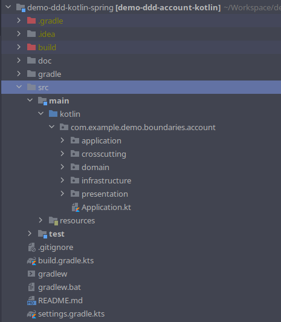
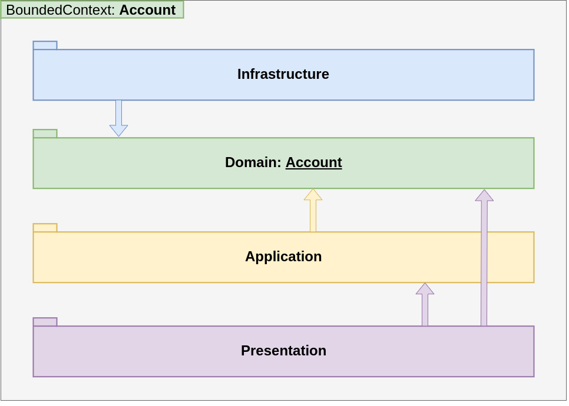
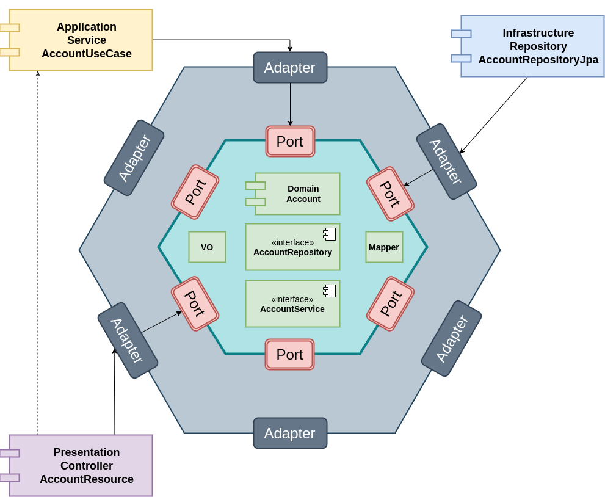

# Demo Project DDD Account Kotlin

> Example of a **study** project of a REST API using DDD with Kotlin and Spring,
> Feel free to give your opinion and send a Pull Request,
> So we can evolve the example together and make it available to the community.

**Stack:**   

- Kotlin 
- Spring Web
- Spring Actuator
- Spring Data
- H2 Database
- Java 8
- Gradle

See more in [Wiki page](https://github.com/fabianogoes/demo-ddd-kotlin-spring/wiki)


### Build Local
---------------

**Build by Gradle**

```
./gradlew clean build
```

**Running by Jar**

```
java -jar build/libs/demo-ddd-account-kotlin*.jar
```

**Test by Postman**

> To use the Postman Collection: `doc\postman_collection.json`


### Domain: Bank Account
------------------------

**Use Cases:**   

- Create New Account
- Create New Movement of Credit (Depósito)
- Create New Movement of Debit (Saque)
- Retrieve Account by Number (Extrato)
- Retrieve All Accounts

### Project Structure
---------------------



### Architecture
---------------- 

**DDD Access layers:**    



**Hexagonal Architecture / Port Adapter:**   

 


### Open Source Project 
-----------------------

The objective of this project is to apply the DDD study using the **Kotlin** as programming language and 
the Web **Spring** as Web Framework.   
By building a REST API exploring the domain of a **Bank Account**.   
The project is as a public so that they can help evolve the idea and share it with the community.  

 


 